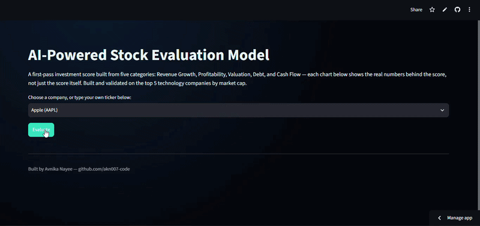

# AI Powered Stock Evaluation Model

A Python based stock evaluation project that collects financial data, converts the data into comparable scores and produces an overall investment score across five categories:

- Revenue Growth
- Profitability
- Valuation
- Debt
- Cash Flow

The project was developed as a practical finance and data analytics project to explore how financial data can be turned into a simple and transparent stock evaluation model.

## Live App

The Streamlit application can be accessed here:

[AI Powered Stock Evaluation Model on Streamlit](https://ai-powered-stock-evaluation-model-5rhkaxviqq63fpcamvx7s9.streamlit.app/)

The application allows users to select one of the companies included in the model or enter their own stock ticker. The results show the overall investment score as well as the individual scores behind it.



## Project Objective

The aim of this project was to build a simple stock evaluation model that takes several financial measures and combines them into one score.

Raw financial data can be difficult to compare because different metrics use different scales. For example, revenue growth is measured as a percentage, while debt to equity and P/E ratios use completely different scales.

The model therefore converts these measures into scores between 0 and 100. This makes it possible to combine them into an overall score.

The model is intended as a first pass evaluation tool rather than a replacement for detailed financial analysis.

## How the Project Developed

I initially tested the data pipeline using Apple, Microsoft and NVIDIA. This helped confirm that the required financial information could be collected and passed into the scoring model.

The next step was to create the scoring system. Five categories were selected and each category was given an equal weighting of 20%.

I then tested the model across companies from different industries. This showed a limitation with using the same financial measures across very different types of businesses.

For example, some financial information was not available in the same way for JPMorgan as it was for technology companies. The model also produced different results for companies such as AT&T, where higher levels of debt can be related to the infrastructure requirements of the telecommunications industry.

This showed that a company can receive a technically valid score without the score necessarily being directly comparable with a company from another industry.

Because of this, the final version of the project was narrowed to five large technology companies:

| Company | Ticker | Business Area |
|---|---|---|
| Apple | AAPL | Consumer electronics |
| Microsoft | MSFT | Software and cloud |
| NVIDIA | NVDA | Semiconductors |
| Alphabet | GOOGL | Search, advertising and cloud |
| Amazon | AMZN | E commerce and cloud |

The decision to use one industry was mainly about improving comparability within the current version of the model.

## Scoring Model

Each company receives a score from 0 to 100 in five categories.

**1. Revenue Growth**

Revenue growth is converted into a score based on the model benchmark.

The current model uses:
- 0% growth = 0 points
- 30% or higher = 100 points
- Values between these points are scored proportionally

**2. Profitability**

The profitability score combines four measures:
- Gross margin
- Operating margin
- Net margin
- Return on equity

The four scores are averaged to produce the final profitability score.

The model uses benchmark levels of 40% for gross margin, 25% for operating margin, 20% for net margin and 25% for return on equity.

Return on equity is capped at 50% when calculating the score because extremely high ROE can sometimes be affected by factors such as leverage or share buybacks.

**3. Valuation**

The valuation category uses:
- Trailing P/E
- Price to book

The model gives higher scores to lower valuation multiples.

The current benchmarks are:
- P/E of 15 or below = 100 points
- P/E of 45 or above = 0 points
- P/B of 2 or below = 100 points
- P/B of 15 or above = 0 points

The model does not attempt to decide whether a high valuation is justified by future growth. That is left for the interpretation of the results.

**4. Debt**

The debt score uses:
- Debt to equity
- Current ratio

Lower debt to equity and a healthier current ratio result in higher scores.

**5. Cash Flow**

The cash flow score uses:
- Free cash flow yield
- Free cash flow to operating cash flow conversion

This category is intended to look at both the amount of free cash flow relative to the company's market value and how effectively operating cash flow is converted into free cash flow.

## Weighting

Each category contributes equally to the overall score.

| Category | Weight |
|---|---|
| Revenue Growth | 20% |
| Profitability | 20% |
| Valuation | 20% |
| Debt | 20% |
| Cash Flow | 20% |
| **Total** | **100%** |

The overall score is calculated by multiplying each category score by its 20% weighting and adding the results together.

The scoring model is deliberately rules based so that the result can be traced back to the underlying financial metrics.

## Final Model Results

The final test produced the following results:

| Company | Overall | Revenue Growth | Profitability | Valuation | Debt | Cash Flow |
|---|---|---|---|---|---|---|
| Alphabet | 73.4 | 80.7 | 100.0 | 77.9 | 90.6 | 17.7 |
| NVIDIA | 71.6 | 100.0 | 100.0 | 30.6 | 91.5 | 35.9 |
| Microsoft | 57.3 | 59.0 | 100.0 | 53.9 | 59.8 | 13.9 |
| Apple | 56.1 | 54.7 | 100.0 | 11.4 | 27.5 | 87.0 |
| Amazon | 55.8 | 65.3 | 85.5 | 80.0 | 45.0 | 3.4 |

These results should not be read as a simple statement that one company is a better investment than another. The purpose of the score is to show how each company performs against the financial rules used by this particular model.

Alphabet received the highest overall score at 73.4. Its strongest results were profitability, debt and valuation. However, its cash flow score was much lower at 17.7. This means the overall score is not being driven by one measure alone. The company performs strongly in several categories, but it also has a clear weakness in cash flow under the current scoring rules.

NVIDIA ranked second with a score of 71.6. It received the maximum score for both revenue growth and profitability, as well as a strong debt score of 91.5. Its main weakness was valuation, where it scored 30.6. This shows that the model is recognising NVIDIA's strong growth and profitability while also reducing its score because of its valuation.

Microsoft scored 57.3. Its profitability score was 100, but its cash flow score was only 13.9. Its valuation and debt scores were also lower than Alphabet and NVIDIA. This suggests that Microsoft's strong profitability is being offset by weaker results in some of the other categories.

Apple scored 56.1. Its strongest category was cash flow at 87.0, while its valuation score was only 11.4 and its debt score was 27.5. This is a good example of why the overall score needs to be looked at together with the individual category scores. Apple performs strongly in cash flow, but the model gives it much lower scores for valuation and debt.

Amazon had the lowest overall score at 55.8. It performed well in revenue growth and valuation, but its profitability score was lower than the other four companies and its cash flow score was only 3.4. The result reflects the current scoring rules and shows that Amazon's strengths in growth and valuation are not enough to offset its weaker profitability and cash flow scores.

Overall, the results show that the model produces different investment profiles rather than simply ranking companies based on growth. Looking at the category scores is therefore important because two companies with similar overall scores can have very different financial profiles.

## Data Pipeline

The data pipeline uses yfinance to retrieve financial information.

The pipeline collects information including:
- Company name, sector and industry
- Revenue growth and earnings growth
- Gross margin, operating margin, net margin and return on equity
- Trailing P/E, forward P/E and price to book
- Market capitalisation
- Debt to equity and current ratio
- Total debt and total cash
- Operating cash flow and free cash flow

The raw data is then passed to the scoring model.

The main data collection function is:

```
get_company_metrics(ticker_symbol)
```

It returns the financial information as a dictionary that can be passed into the scoring engine.

## Scoring Engine

The scoring engine contains separate functions for each category:

```
score_revenue_growth()
score_profitability()
score_valuation()
score_debt()
score_cash_flow()
```

These scores are then combined using:

```
calculate_investment_score()
```

The model keeps each score between 0 and 100 using a `clamp()` function.

This makes the model easier to understand because the calculation does not depend on a black box prediction.

## Streamlit Application

The Streamlit application provides a simple interface for using the model.

Users can:
- Select a company from the available options, or enter a custom stock ticker
- Run the evaluation
- View the overall investment score as a gauge
- View a radar chart summarising all five category scores at a glance
- View individual charts comparing each category's real figures against the benchmark used to score them
- See the raw financial figures behind the category scores

The purpose of showing the underlying numbers is to make the score easier to understand rather than only displaying one final number.

## Full Analysis Notebook

The full development process, including the initial three-company test, the wider industry test that revealed the sector comparability problem, and the reasoning behind narrowing the project to five technology companies, is documented step by step in the Jupyter notebook included in this repository:

[`Stock_Evaluation_Model_Analysis.ipynb`](./Stock_Evaluation_Model_Analysis.ipynb.ipynb)

This is the working notebook the project was built and tested in before the logic was moved into the standalone `data_pipeline.py` and `scoring_model.py` files used by the Streamlit app.

## Why AI Was Used

AI was used as a development tool during this project to help with areas such as code development, debugging, restructuring the analysis and improving the way the financial results were presented.

The use of AI also helped with the process of turning the initial idea into a working application and allowed different approaches to the data pipeline, scoring model and Streamlit interface to be tested more quickly.

However, the actual investment scoring model is not an AI prediction model.

The scoring rules are explicitly defined in Python. The model uses financial metrics, predefined benchmark ranges and equal category weightings to calculate the final score.

This distinction is important because the project is intended to demonstrate how financial data and programming can be combined with AI assisted development, rather than claiming that AI can predict which stock will perform best.

## Technologies Used

- Python
- Pandas
- yfinance
- Streamlit
- Plotly
- Jupyter Notebook
- GitHub

## Project Structure

```
Stock Evaluation Model
│
├── data_pipeline.py
├── scoring_model.py
├── batch_runner.py
├── streamlit_app.py
├── requirements.txt
├── Stock_Evaluation_Model_Analysis.ipynb
└── README.md
```

`data_pipeline.py` is responsible for collecting the financial information.

`scoring_model.py` contains the scoring functions and overall scoring calculation.

`batch_runner.py` runs the pipeline and scoring model across the full list of companies and ranks them.

`streamlit_app.py` provides the user interface for interacting with the model.

## Limitations

There are several limitations to the current version of the model.

**General benchmarks**

The scoring benchmarks are general purpose benchmarks rather than technology sector specific benchmarks. A future version could use sector relative benchmarks.

**Equal weighting**

Every category currently receives a 20% weighting. Different investors may place more importance on growth, valuation, cash flow or another factor.

**Missing data**

Where certain financial data is unavailable, some parts of the model use a neutral score of 50. This does not mean that the company actually performed at 50. It means the required information was not available for that calculation.

**Industry scope**

The final model focuses on five technology companies. This makes the current comparison more consistent, but it also means that the model has not been fully tested across all industries.

**Market data changes**

Financial and market data can change over time. Running the model at a different time may therefore produce different results.

## Possible Future Improvements

- Using sector specific benchmarks
- Adding more financial indicators
- Testing different category weightings
- Adding historical data across multiple years
- Adding charts showing changes over time
- Improving the treatment of missing data
- Adding a more detailed company comparison page
- Backtesting the scoring model against historical performance
- Adding a formal validation process for the scoring methodology

## Disclaimer

This project was created for educational and project based purposes. The financial data, calculations and scores have not been independently fact checked, audited or validated as an investment methodology. The results are produced by the rules defined in this project and should not be treated as financial advice, investment advice or a recommendation to buy or sell any security. Financial data can change and the results may differ when the model is run at another time. Users should carry out their own research and consult a qualified financial professional before making investment decisions.
